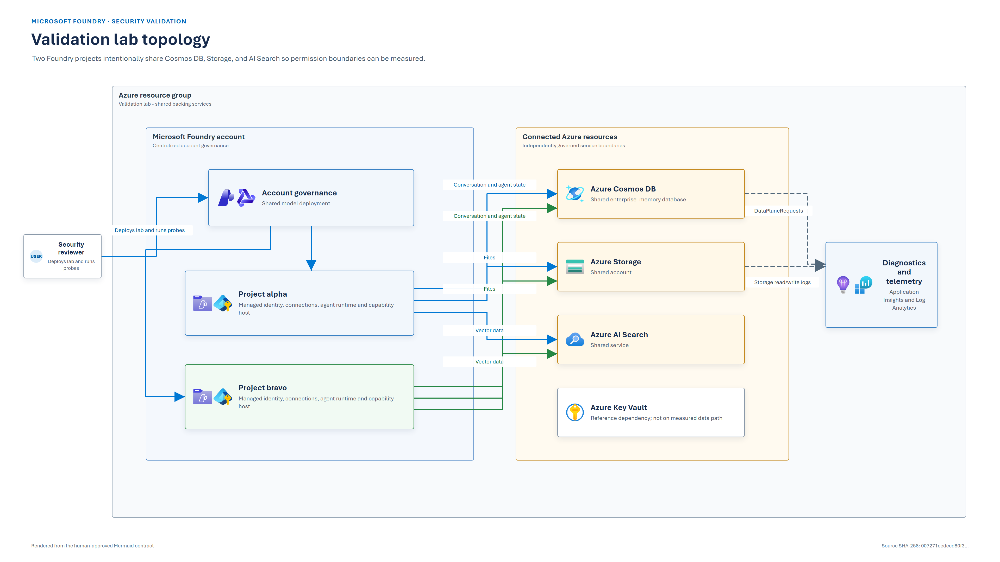

# Foundry Stranger Danger

**In a default multi-project Microsoft Foundry deployment, project data is separated
programmatically, not by a project-level RBAC boundary on the backing stores.**

Foundry knows which project is running. It creates project-specific Cosmos containers, Blob
containers, and Search indexes, then routes normal project traffic to those resources. That
programmatic routing keeps the projects separate during normal operation.

The backing services answer a different question: if a project identity directly asks for another
project's container or index, is it authorized? When the identity has a database-, account-, or
service-scoped role, the answer can be yes. Generated names tell the runtime where data belongs;
they do not make the data inaccessible to a broadly authorized credential.

This lab makes that distinction visible, proves it with direct data-plane requests, and demonstrates
a hardened multi-project alternative:

- **Cosmos DB:** project-container RBAC enforced by the database service;
- **Azure Storage:** project-prefix ABAC enforced by the storage service;
- **Foundry:** two projects, identities, capability hosts, and agents remain in one account;
- **AI Search:** retained as the shared control case because generated index ownership is not a
  durable project authorization contract.

> [!NOTE]
> The lab found no cross-project routing defect in Foundry. The finding is that runtime routing may
> be the only project boundary unless authorization on each connected data service is narrowed too.

## Programmatic isolation versus enforced isolation

| Layer | What it does | What it does not do |
|---|---|---|
| Programmatic isolation | Foundry carries project context, generates project-specific names, and routes each project to its own data | Stop a broadly authorized identity from directly addressing another project's resource |
| Authorization isolation | Cosmos RBAC, Storage ABAC, or Search RBAC rejects access outside the identity's allowed scope | Decide which resource the Foundry runtime should use |
| Resource isolation | Separate backing accounts or services prevent service-scoped roles from spanning projects | Preserve the lower cost and operational simplicity of shared services |

The first layer is the default isolation model explored here. The second layer is the hardened
alternative implemented for Cosmos and Storage. The third is the recommended boundary when
projects are mutually untrusted.

By "default" this README means an un-hardened multi-project topology that shares connected data
services and relies on Foundry's project-aware routing. Exact roles vary by deployment path. Inspect
the effective assignments in your environment rather than assuming a template has a particular
scope.

## What the default multi-project shape looks like



One Foundry account contains projects `alpha` and `bravo`. Each project has its own identity,
endpoint, agent runtime, connections, capability host, and generated data objects. Both projects
connect to one shared Cosmos DB account, one Storage account, and one AI Search service.

| Store | How Foundry keeps project data apart | What happens with broad authorization |
|---|---|---|
| Cosmos DB | Five containers per project use the project's internal GUID as a prefix | A role on the shared `enterprise_memory` database reaches both projects' containers |
| Azure Storage | Two generated Blob containers per project use the dashed project GUID as a prefix | An unconditioned account-scoped Blob data role reaches both projects' containers |
| AI Search | A vector store is associated with a generated index | A service-scoped Search data role reaches both projects' indexes |

The runtime selects the right resource, but a broad credential is not independently constrained to
that resource.

## What this lab tests

The experiment bypasses normal Foundry routing and asks each backing service directly:

> If the alpha-shaped identity requests bravo's data, does the data service deny it?


| Store | Broad control | Project-constrained control |
|---|---|---|
| Cosmos DB | Data role on the shared database | Data role on each owned container |
| Azure Storage | Unconditioned Blob data role on the shared account | Account role conditioned on the project's container-name prefix |
| AI Search | Data role on the shared service | Data role on one selected index |

The probes use direct Azure data-plane requests. An own-project success proves the path is live; only
then does a cross-project denial count as authorization evidence. A firewall refusal is `BLOCKED`,
not `DENY`.

## What the lab found

| Store | Broad result | Constrained result | Conclusion |
|---|---|---|---|
| Cosmos DB | Database scope allowed reads from both projects | Container scope allowed the owner and denied the other project | Cosmos data-plane RBAC can enforce the project boundary |
| Azure Storage | Unconditioned account scope allowed reads from both projects | Project-prefix condition allowed the owner and denied the other project | Storage ABAC can enforce the project boundary |
| AI Search | Service scope allowed reads from both project indexes | Single-index scope allowed the selected index and denied the other | Search enforces index RBAC, but Foundry did not expose a durable project-to-index mapping |

The result is not "Foundry sends alpha traffic to bravo." It is:

> Foundry sends alpha traffic to alpha, but a credential authorized above alpha's resource can use
> another code path to reach bravo.

That distinction is the point of the repository.

Accepted evidence run:
[`20260903T220650154Z-14a2c4a0`](evidence/published/20260903T220650154Z-14a2c4a0/REPORT.md).

## The hardened multi-project alternative

The hardened lab keeps the same Foundry account, projects, identities, capability hosts, and shared
Cosmos and Storage services. It adds authorization enforcement beneath Foundry's programmatic
routing.

### Cosmos DB: container-scoped RBAC

Each project identity receives `Cosmos DB Built-in Data Contributor` on exactly five owned
containers:

```text
/dbs/enterprise_memory/colls/<project-guid>-thread-message-store
/dbs/enterprise_memory/colls/<project-guid>-system-thread-message-store
/dbs/enterprise_memory/colls/<project-guid>-agent-entity-store
/dbs/enterprise_memory/colls/<project-guid>-agent-definitions-v1
/dbs/enterprise_memory/colls/<project-guid>-run-state-v1
```

The project identity has no account- or database-scoped Cosmos data role in the hardened state. If
alpha directly requests a bravo container, Cosmos rejects the request regardless of what the
Foundry runtime would normally route.

### Azure Storage: prefix-conditioned ABAC

Each project identity receives one account-scoped `Storage Blob Data Owner` assignment with an ABAC
condition. Blob data actions are allowed only when the container name starts with the identity's
dashed project GUID.

The role stays at account scope because one generated container contains an unpredictable segment:

```text
<project-guid>-azureml-blobstore
<project-guid>-<service-assigned-segment>-azureml-agent
```

Constructing complete names is brittle. Storage also accepts an assignment scoped to a container
that does not exist, which can make a bad role look successfully deployed while denying the owning
project. The prefix is the stable project attribute, and the verifier tests both own-project access
and cross-project denial.

### AI Search: measured, not hardened by this deployment

Single-index Search RBAC worked in the test. The operational problem was ownership: the Foundry
vector-store response did not expose the generated index name, and the index name did not identify
its project. The lab established ownership only by creating one vector store at a time and diffing
the service's index list.

That is enough to test index RBAC, but it is not a durable production mapping. Project identities
therefore remain service-scoped in this lab so the programmatic Search boundary stays measurable.
Use one Search service per project when vector data needs an independently enforceable boundary.

## Why hardening is a two-phase deployment

A clean shared-Cosmos deployment cannot begin with all five container roles. The capability host
creates three containers first. These two appear only after the first Responses API invocation:

```text
<project-guid>-agent-definitions-v1
<project-guid>-run-state-v1
```

Cosmos rejects a role assignment for a container that does not exist. The supported workflow uses a
bounded bootstrap window:

| Phase | Action | Boundary state |
|---|---|---|
| 0. Preflight | Check tools, access, providers, model quota, and configuration | Nothing is declared usable |
| 1. Bootstrap | Deploy both projects with temporary access to the shared Cosmos database | Foundry routing is the project boundary; synthetic data only |
| 2. Materialize | Invoke one canary agent per project and discover all five containers | Every Cosmos target now exists |
| 3. Harden | Add five container roles per project and remove the database roles | Cosmos RBAC and Storage ABAC enforce direct data access |
| 4. Verify | Inspect real assignments and run own-project and cross-project probes | Fail closed unless every expected result matches |

> [!WARNING]
> During bootstrap, either project identity can address the other project's Cosmos containers.
> Do not assign users or applications or introduce real data until verification succeeds.

Precreating the lazy containers is not recommended because their indexing policy is service-owned
and can change. Terraform's steady-state `isolation_mode` defaults to `hardened`, but
[terraform/guardrails.tf](terraform/guardrails.tf) blocks a clean plain apply while those containers
are absent. Use the orchestrator.

## Deploy the baseline and hardened alternative

Use a disposable subscription or isolated test resource group. The lab creates broad controls,
stores temporary service-principal secrets in Terraform state, and intentionally uses public data
endpoints so it can distinguish an authorization denial from a network block. Local key
authentication is disabled for Cosmos, Storage, and Search.

Prerequisites are PowerShell 7, Azure CLI, Terraform 1.9 or later, permission to create role
assignments and Entra app registrations, and quota for the selected model.

```powershell
.\scripts\00b-find-search-region.ps1

Copy-Item .\terraform\terraform.tfvars.example .\terraform\terraform.tfvars
# Edit subscription_id, location, search_location, owner, and required tags.

terraform -chdir=terraform init
.\scripts\deploy-and-harden.ps1
```

The orchestrator deploys the multi-project topology, materializes the service-owned containers,
replaces the broad Cosmos data roles, and verifies the Cosmos RBAC and Storage ABAC boundary. A
successful exit does not certify shared Search.

The canary data remains after the script succeeds. Remove it before assigning real users or
applications.

## How the lab proves enforcement

The lab does not infer isolation from generated names or from a successful deployment. It checks the
real role assignments and then exercises the data services directly. Both gates must pass.

**Configuration**

- Exactly five container-scoped Cosmos data assignments exist for each project identity.
- No project identity retains a Cosmos data assignment at database or account scope.
- Exactly one account-scoped, conditioned `Storage Blob Data Owner` assignment exists per project.
- No unconditioned account-scoped Blob data role remains on a project identity.
- Every expected container is attributable to its project.

**Behavior**

| Probe | Alpha Cosmos | Alpha Blob | Bravo Cosmos | Bravo Blob |
|---|---|---|---|---|
| Broad connectivity control | `ALLOW` | `ALLOW` | `ALLOW` | `ALLOW` |
| Alpha-scoped | `ALLOW` | `ALLOW` | `DENY` | `DENY` |
| Bravo-scoped | `DENY` | `DENY` | `ALLOW` | `ALLOW` |

That is twelve required outcomes: $3$ probes x $2$ projects x $2$ stores. An own-project denial,
unexpected error, or `BLOCKED` network result invalidates the run. A firewall refusal is defense in
depth, not proof that RBAC denied the request.

Rerun verification against an existing deployment with:

```powershell
.\scripts\deploy-and-harden.ps1 -VerifyOnly
```

## Apply the pattern to an existing deployment

1. Inventory each project's identity, internal GUID, connected Cosmos account, Storage account, and
   Search service.
2. Enumerate the actual generated containers and indexes. Do not reconstruct ownership from an
   assumed full name.
3. For shared Cosmos, add all five project-container data assignments before removing the
   database-scoped assignment.
4. For shared Storage, replace unconditioned Blob data roles with the tested project-prefix ABAC
   condition.
5. For Search, use index RBAC only when a durable project-to-index mapping exists. Otherwise split
   the Search service wherever authorization must enforce the project boundary.
6. Disable local and shared-key authorization so identity policy cannot be bypassed.
7. Verify the real project role inventory and run positive and negative data-plane controls.
8. Preserve the configuration and probe evidence together, remove synthetic data, and only then
   grant workload access.

Use the [hardening guide](docs/05-hardening-guide.md) for audit commands, exact assignment shapes,
failure recovery, and the completion checklist.

## Scope of the hardened boundary

| Claim | Supported? |
|---|---|
| Each project identity can directly read its own Cosmos and Blob resources | Yes |
| Each scoped probe is denied direct reads against the other project's Cosmos and Blob resources | Yes |
| Shared Search is project-isolated | No; the lab intentionally leaves service-scoped Search access |
| A compromised project identity cannot affect another project | No; shared-service management roles remain |
| Project-prefixed names alone enforce authorization | No |
| Production private networking, availability, backup, or disaster recovery is validated | No |

The hardened result adds a data-service authorization boundary beneath Foundry's programmatic
boundary. It prevents accidental or alternate-path direct reads across projects for Cosmos and
Blob.

It is not a hostile-identity boundary. Project identities retain service-wide provisioning roles
needed by the shared topology, including `Cosmos DB Operator`, `Storage Account Contributor`, and
`Search Service Contributor`. The lab did not exercise a compromised identity using those
management actions to change service configuration or disrupt another project.

Use the shared hardened pattern inside one accepted trust domain. Use a separate Cosmos account,
Storage account, and Search service per project when the projects represent different customers,
tenants, owners, sensitivity classes, residency requirements, or incident boundaries.

## Collect evidence and tear down

After the orchestrator succeeds, collect a manifest-bound run:

```powershell
.\scripts\12-collect-evidence.ps1 -SkipAgents
```

Generated evidence is written under `evidence/runs/<run-id>-<mode>/` with source hashes, artifact
hashes, configuration assertions, and an offline validation result. Raw evidence is gitignored.

Destroy the disposable environment when finished:

```powershell
.\scripts\99-destroy.ps1
```

## Read next

| Goal | Document |
|---|---|
| Review the complete findings | [Customer assessment](docs/00-report.md) |
| Compare the lab and target architectures | [Architecture](docs/01-architecture.md) |
| Reproduce the experiment | [Validation runbook](docs/03-validation-runbook.md) |
| Apply the controls to an existing environment | [Hardening guide](docs/05-hardening-guide.md) |
| Review the approved architecture figures | [Architecture figures](docs/diagrams/README.md) |
| Understand evidence provenance and publication | [Evidence guide](evidence/README.md) |

## Scope and limitations

- Modern Foundry Agents using the Responses API (`api-version=v1`) were tested.
- Two projects and one Foundry account were measured; this is not a scale, performance,
  availability, regional-resiliency, or failover assessment.
- Public endpoints were used to isolate authorization behavior. Production networking was not
  assessed.
- Project managed identities cannot be impersonated. Surrogate principals exercise equivalent
  permission shapes while separate assertions inspect the real project identities.
- Persistent provisioning roles were inventoried, but management-plane attack paths were not
  exercised.

## Microsoft references

Sources were reviewed on **2 September 2026**:

- [Use your own resources in Foundry Agent Service](https://learn.microsoft.com/en-us/azure/foundry/agents/how-to/use-your-own-resources)
- [Microsoft Foundry architecture](https://learn.microsoft.com/en-us/azure/foundry/concepts/architecture)
- [Azure Cosmos DB data-plane RBAC](https://learn.microsoft.com/en-us/azure/cosmos-db/how-to-connect-role-based-access-control)
- [Azure AI Search RBAC](https://learn.microsoft.com/en-us/azure/search/search-security-rbac)
- [Azure Storage ABAC](https://learn.microsoft.com/en-us/azure/storage/blobs/storage-auth-abac)

## Repository contents

| Path | Purpose |
|---|---|
| [terraform/](terraform) | Multi-project topology and broad/hardened permission shapes |
| [scripts/](scripts) | Deployment, direct probes, evidence packaging, and teardown |
| [docs/](docs) | Full findings, architecture, runbook, and hardening guidance |
| [docs/diagrams/](docs/diagrams) | Authoritative Mermaid architecture contracts |
| [evidence/](evidence) | Generated evidence layout and tracked publication guidance |

## License

[MIT](LICENSE)
