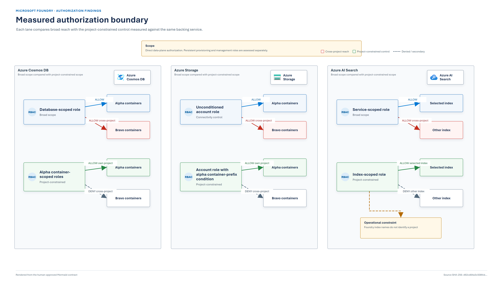

# Microsoft Foundry cross-project data isolation assessment

| | |
|---|---|
| Assessment date | 3 September 2026 |
| Audience | Customer security, platform, architecture, and operations teams |
| Question | When Foundry projects share backing services, what prevents one project identity from reaching another project's data? |
| Runtime tested | Modern Foundry Agents, Responses API `v1` |
| Release status | **Final technical assessment** |
| Accepted evidence | [`20260903T220650154Z-14a2c4a0`](../evidence/published/20260903T220650154Z-14a2c4a0/REPORT.md) |

## Executive decision

Microsoft Foundry creates distinct project assets. The connected Cosmos DB, Storage, and AI
Search services remain independently governed Azure resources, so their topology and role scopes
determine the effective data boundary.

In the default shared-service shape, normal project separation is programmatic: Foundry carries
project context and routes each project to generated project-specific resources. This assessment
does not demonstrate a routing defect. It asks whether each backing service independently rejects a
direct request for another project's data when a project credential is used outside that runtime
path.

The assessment measured the following authorization behavior:

| Store | Measured control behavior | Decision |
|---|---|---|
| Azure Cosmos DB | Database scope reached both projects. Container scope allowed the owning project and denied the other project. | A shared account requires two-phase bootstrap followed by five container grants per project. Use separate accounts where projects do not share a trust boundary. |
| Azure Storage | An account assignment with a project-container-prefix ABAC condition allowed the owning project and denied the other project. | Retain a shared account only within one trust boundary and use a tested prefix condition. Never depend on constructed service-generated container names. |
| Azure AI Search | Service scope reached both project indexes. Single-index scope was enforced, but the Foundry vector-store response did not expose the index name and generated index names did not identify the project. | Use a Search service per project whenever vector data requires a hard project boundary. |

**Customer direction:** projects representing separate customers, tenants, owners, or sensitivity
classes should use separate Cosmos DB, Storage, and AI Search resources. Shared Cosmos and Storage
are reasonable only inside one accepted trust boundary after hardening and verification.

*Figure 1. Recommended target state for projects that require separate data trust boundaries.*

No direct cross-project routing defect in the Foundry runtime was demonstrated. The primary risk is
permission blast radius: a credential broader than the intended project boundary removes defense in
depth and expands the consequence of misuse or compromise.

**Threat-model boundary:** the probes measure direct data-plane authorization. The project identities
also retain service-wide provisioning roles in the shared lab. Azure's built-in Storage Account
Contributor and Search Service Contributor roles include broad management actions on their
respective services. This assessment did not exercise a compromised identity changing account
settings, retrieving or enabling credentials, modifying Search objects, or disrupting another
project. Therefore shared-service hardening is appropriate only inside one accepted trust boundary;
it is not a hard hostile-identity boundary.

## Assurance statement

This report distinguishes four evidence classes:

| Label | Meaning |
|---|---|
| **Measured** | Observed through live direct Azure data-plane requests in the validation environment |
| **Configuration-verified** | Read from the deployed role assignments and resource inventory |
| **Platform-sourced** | Supported by current first-party Microsoft documentation |
| **Recommended** | Architecture or operating guidance derived from the measured and sourced facts |

A valid result requires both configuration and behavior checks. Probe behavior alone cannot prove
what the real project identities currently hold; configuration alone cannot prove that a recorded
scope is enforced.

### Controls used

1. A deployer control confirms that both projects' resources exist and are attributable.
2. Each project emits a distinct canary through its own endpoint.
3. Scoped probes must receive `ALLOW` on their own project before any cross-project `DENY` is
   accepted as evidence.
4. A broad probe confirms the data path is reachable. Its Cosmos role models database scope; its
   unconditioned Blob role is a connectivity control, not a model of project Blob guidance.
5. Network-origin refusals are `BLOCKED`, never `DENY`.
6. Unexpected statuses remain `ERROR` and invalidate the run.
7. The evidence manifest binds artifacts to a run ID, source commit, producer hashes, and artifact
   hashes.

See the [validation runbook](03-validation-runbook.md) and
[test-control contract](diagrams/test-controls-and-evidence.mmd).

## Scope

The validation lab deployed:

- one Foundry account;
- projects `alpha` and `bravo`, each with a system-assigned managed identity;
- one shared Cosmos DB account and `enterprise_memory` database;
- one shared Storage account;
- one shared AI Search service;
- one agent invocation per project using the Responses API;
- three surrogate service principals representing scoped and broad read shapes;
- Cosmos and Storage diagnostics routed to Log Analytics.

Public endpoints were used so authorization could be isolated from private-network reachability.
This is a test design choice, not a production network recommendation. The
[architecture document](01-architecture.md) separates this lab from the recommended customer
target state.

## Results

*Figure 2. Broad-scope reach compared with each project-constrained control.*

### Cosmos DB

**Measured:**

| Principal | Alpha containers | Bravo containers |
|---|---|---|
| Broad database-scoped probe | `ALLOW` | `ALLOW` |
| Alpha container-scoped probe | `ALLOW` | `DENY` |
| Bravo container-scoped probe | `DENY` | `ALLOW` |

**Configuration-verified:** the broad control held one role at `/dbs/enterprise_memory`; hardened
project identities and scoped probes each held five roles under
`/dbs/enterprise_memory/colls/<project-container>`.

**Conclusion:** physical separation by container does not constrain a database-scoped identity.
Container-scoped Cosmos RBAC does enforce the intended boundary.

### Azure Storage

**Measured:**

| Principal | Alpha containers | Bravo containers |
|---|---|---|
| Unconditioned account-scope connectivity control | `ALLOW` | `ALLOW` |
| Alpha prefix-conditioned probe | `ALLOW` | `DENY` |
| Bravo prefix-conditioned probe | `DENY` | `ALLOW` |

The service created containers using a dashed project GUID. One container also contained a
service-assigned segment, so its complete name could not be predicted safely in infrastructure as
code. Storage accepted role assignments whose target container did not exist, making a bad
constructed name look successful while granting no usable access.

**Conclusion:** enumerate containers when auditing, and use an account-scoped Blob data role with a
condition matching the project's container-name prefix.

### Azure AI Search

**Measured:**

| Grant | Selected project index | Other project index |
|---|---|---|
| Single-index `Search Index Data Reader` | `ALLOW` | `DENY` |
| Service-scoped `Search Index Data Reader` | `ALLOW` | `ALLOW` |

Current Azure AI Search documentation explicitly supports single-index assignments. The operational
issue observed here was attribution: creating a Foundry vector store produced an opaque index name,
and the vector-store response did not expose that name. The test could establish ownership only by
serially creating one vector store and diffing the service's index list.

**Conclusion:** index-scoped authorization works, but an observed create-and-diff procedure is not a
durable production ownership contract. Separate Search services provide the clear boundary when
projects must be isolated.

## Findings

### F1. Shared-database Cosmos scope expands the project credential boundary

**Impact:** High where projects represent different trust boundaries; Medium where all projects are
operated as one trust domain.

**Status:** Measured and configuration-verified.

A role at `enterprise_memory` reaches every project container in that database. The runtime may use
correct project-specific names, but RBAC supplies no second barrier if the identity is used through
another code path.

**Required action:** replace temporary database scope with five project-container assignments before
users, applications, or real data are introduced.

### F2. Constructed Blob container scopes can be silently ineffective

**Impact:** Medium.

**Status:** Measured.

Observed names differed from the previously assumed pattern, and Storage accepted assignments to
absent containers. An own-project `DENY` exposed the dead assignment; without that positive control,
the result could have been misreported as isolation.

**Required action:** enumerate actual containers, remove dead assignments, and use a tested
project-prefix ABAC condition.

### F3. Shared Search is not a durable Foundry project boundary for vector data

**Impact:** High where vector data crosses trust boundaries; Medium otherwise.

**Status:** Measured, with the single-index scope also platform-sourced.

Search enforces index scope, but the tested Foundry interface did not provide a durable mapping from
project vector store to generated index. Service-scoped roles reach all indexes, and Search object
management permissions require separate consideration.

**Required action:** use one Search service per project for strict separation.

### F4. Persistent provisioning roles keep shared services inside one trust boundary

**Impact:** High if project identities are treated as mutually hostile or independently operated.

**Status:** Configuration-verified and platform-sourced; escalation paths were not exercised.

The lab's project identities retain Storage Account Contributor and Search Service Contributor at
their shared service scopes because capability hosts provision and manage backing resources. These
roles include broad management actions. Cosmos DB Operator is also service-wide, although its
built-in exclusions remove key retrieval and Cosmos data-role assignment operations.

The Blob ABAC result remains valid for direct Blob requests, but it does not neutralize a broader
management role held by the same identity. Likewise, index-scoped Search reads do not constrain a
service-scoped Search object manager.

**Required action:** do not describe shared-service ABAC or container RBAC as a hostile-project
boundary. Use separate backing services when project identities must not be able to affect each
other.

## Operational observations

These affect repeatability but are not cross-project data findings:

| ID | Observation | Response |
|---|---|---|
| O1 | Connection names behaved as account-wide names despite project-scoped ARM paths. | Suffix every connection name by project. |
| O2 | Concurrent child operations returned retryable `409 RequestConflict` or ETag conflict responses. | Serialize capability-host creation and retain bounded retry. |
| O3 | Two modern Cosmos containers appeared only after the first Responses API invocation. | Use a two-phase bootstrap for shared Cosmos. |
| O4 | Tenant automation changed public access and made authorization probes return network `403` responses. | Classify these as `BLOCKED`, restore intended test reachability, and rerun. |

## Required action register

| Priority | Action | Accountable role | Completion evidence |
|---|---|---|---|
| P0 | Classify whether projects share a trust boundary. | Security architect and data owner | Approved architecture decision naming the project/data boundary |
| P0 | Allocate a Search service per project where vector data requires isolation. | Platform architect | Connection inventory shows one project per Search service |
| P0 | Keep projects with mutually untrusted identities on separate backing resources. | Security architect | Project-to-resource inventory contains no shared data service across trust boundaries |
| P1 | Replace shared-database Cosmos grants after bootstrap. | Platform engineering | Inventory shows exactly five container grants per project and no broader project grant |
| P1 | Replace constructed Blob scopes with a reviewed prefix condition. | IAM/platform engineering | One conditioned Blob owner assignment per project; no unconditioned project data role |
| P1 | Run both positive and negative controls for Cosmos and Blob. | Security validation owner | Manifest-valid matrix with all 12 expected outcomes |
| P1 | Generate a fresh Search evidence artifact identifying the exact tested indexes. | Security validation owner | Manifest-valid `search-isolation.json` with one tested index per project |
| P2 | Disable local/shared-key authorization and enable data-plane diagnostics. | Service owners | Configuration export and diagnostic settings evidence |
| P2 | Remove synthetic canary data before handover. | Deployment owner | Cleanup record attached to the deployment change |

The automated commands and failure handling are in the [hardening guide](05-hardening-guide.md).

## Evidence release record

Fresh run `20260903T220650154Z-14a2c4a0` completed on 3 September 2026 and passed the offline
evidence contract. It recorded:

- two successful Responses API canaries;
- five Cosmos and two Blob containers attributable to each project;
- exactly five project-container Cosmos grants per project identity;
- exact project-prefix Storage conditions and no additional project Blob data role;
- all twelve expected Cosmos/Blob outcomes;
- one exact Search index attributed during serialized creation for each project;
- selected-index `ALLOW`, other-index `DENY`, and service-scope `ALLOW` for both indexes;
- producer and raw-artifact SHA-256 hashes.

The tracked [customer evidence bundle](../evidence/published/20260903T220650154Z-14a2c4a0/REPORT.md)
is a sanitized derivative. The raw run remains local and gitignored. Its manifest recorded a dirty
Git working tree, so assurance relies on the retained and hash-verified snapshots of 9 evidence
producers and 17 Terraform/deployment source files, plus recorded Terraform, Azure CLI, and
PowerShell versions. Historical unmanifested files remain research inputs only.

## Limitations

- Project managed identities cannot be impersonated; surrogate principals tested equivalent
  permission shapes while configuration checks inspected the actual identities.
- Two projects in one account were assessed. Foundry, Cosmos, and Storage ran in `westus3`; Search
  ran in `eastus` because of capacity. Scale, regional resilience, failover, availability,
  performance, cost, backup, and disaster recovery were not tested.
- Public endpoint authorization was assessed; production private networking and DNS were outside
  scope.
- Direct data-plane authorization was tested. Management-plane escalation and cross-project
  integrity/availability attacks through persistent provisioning roles were not exercised.
- Only modern Responses API agents were exercised. Classic Assistants API behavior was not the
  runtime under assessment.
- Service behavior and generated naming can change. Evidence producers therefore enumerate actual
  resources and bind results to source hashes.
- The Search recommendation is an isolation decision, not a claim that single-index RBAC is
  unsupported. Current Microsoft documentation confirms that it is supported.

## First-party references

Reviewed 2 September 2026:

- [Use your own resources in Foundry Agent Service](https://learn.microsoft.com/en-us/azure/foundry/agents/how-to/use-your-own-resources)
- [Microsoft Foundry architecture](https://learn.microsoft.com/en-us/azure/foundry/concepts/architecture)
- [Azure Cosmos DB data-plane RBAC](https://learn.microsoft.com/en-us/azure/cosmos-db/how-to-connect-role-based-access-control)
- [Azure AI Search RBAC](https://learn.microsoft.com/en-us/azure/search/search-security-rbac)
- [Azure Storage ABAC](https://learn.microsoft.com/en-us/azure/storage/blobs/storage-auth-abac)
- [Foundry Agent Service private networking](https://learn.microsoft.com/en-us/azure/foundry/agents/how-to/virtual-networks)
