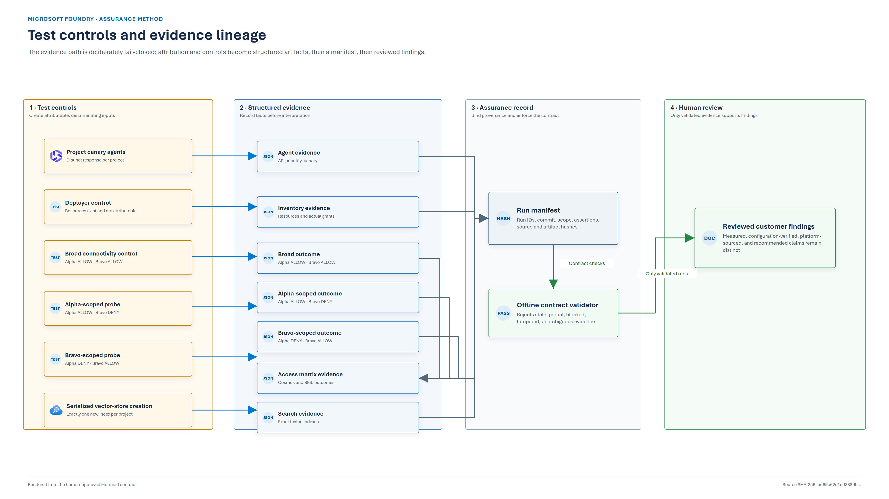

# Validation runbook

This runbook reproduces the cross-project authorization measurements and creates a traceable evidence
package. It is for a disposable validation environment, not an existing production deployment.

The probes intentionally bypass Foundry's normal project-aware routing and call the connected data
services directly. Their purpose is to distinguish programmatic project separation from a Cosmos
RBAC, Storage ABAC, or Search RBAC denial enforced by the backing service.

## Safety boundary

The lab intentionally creates broad read controls and stores temporary service-principal credentials
in local Terraform state.

- Use a disposable subscription or isolated test resource group.
- Do not introduce customer, production, or regulated data.
- Do not share `terraform.tfstate`, `.secrets`, raw agent evidence, or terminal logs.
- Do not assign developers or applications to the projects during bootstrap.
- Treat any incomplete or failed hardening run as unavailable for real use.
- Tear the environment down after evidence collection.

## 1. Prerequisites

Required local tools:

- PowerShell 7;
- Azure CLI;
- Terraform 1.9 or later;
- Node.js/npm only when validating Mermaid contracts.

Required Azure permissions:

- create the resource types in the target resource group;
- create and delete app registrations for probe identities;
- create Azure and Cosmos data-plane role assignments;
- deploy the selected model and consume its quota.

Initialize configuration before preflight so the orchestrator can resolve the effective Terraform
region and model:

```powershell
Copy-Item .\terraform\terraform.tfvars.example .\terraform\terraform.tfvars
# Edit subscription_id, location, search_location, owner, and any required tags.

terraform -chdir=terraform init
.\scripts\00-preflight.ps1 -Location <foundry-region> -ModelName <model-name>
.\scripts\00b-find-search-region.ps1
```

`deploy-and-harden.ps1` runs preflight again and automatically reads `var.location` and
`var.model_name`. Explicit overrides are available through `-PreflightLocation` and
`-PreflightModelName`.

Search capacity is independent from Foundry/model capacity. Set `search_location` to a region with
capacity rather than moving the whole lab when only Search is constrained.

## 2. Recommended end-to-end workflow

```powershell
.\scripts\deploy-and-harden.ps1
```

The orchestrator performs these phases:

1. Validate tooling, sign-in, providers, permissions, and model quota.
2. Deploy the lab with temporary database-scoped Cosmos access.
3. Invoke one synthetic canary agent per project through Responses API `v1`.
4. Confirm all five Cosmos containers per project exist.
5. Replace each project database grant with five container grants.
6. Inventory the real project Cosmos and conditioned Storage grants.
7. Run own-project and cross-project probes for both stores.
8. Fail closed unless configuration and behavior both match.

A successful result means **Cosmos and Storage hardening is verified**. AI Search remains shared in
the lab so its behavior can be measured separately; success is not approval of shared Search for
production.

The deployment sequence is captured in the
[bootstrap/harden/verify contract](diagrams/bootstrap-harden-verify-sequence.mmd).

## 3. Generate a complete evidence run

After the orchestrator succeeds:

```powershell
.\scripts\12-collect-evidence.ps1 -SkipAgents
```

`-SkipAgents` reuses the manifest-compatible `agents.json` produced by the orchestrator. The
collector rejects historical or malformed agent evidence before running other probes.

By default the collector:

1. inventories actual containers and role assignments;
2. runs the Cosmos and Blob matrix;
3. serially creates one vector store per project;
4. polls for exactly one new Search index after each creation;
5. measures single-index and service-scoped Search reads;
6. writes a readable report and machine-readable manifest;
7. archives the run under `evidence/runs/<UTC-run-id>-<isolation-mode>/`;
8. runs the offline evidence validator.

Use `-SkipSearch` only when the run is explicitly scoped to Cosmos and Storage. The manifest records
that Search was omitted, and the evidence must not be cited as a complete three-store assessment.

### Artifacts



*Figure 1. Test controls and evidence lineage. [Approved Mermaid contract](diagrams/test-controls-and-evidence.mmd).*

| Artifact | Content |
|---|---|
| `manifest.json` | Run status, run/source IDs, commit and dirty state, producer hashes, deployment identity, assertions, and artifact hashes |
| `REPORT.md` | Human-readable summary generated from structured evidence |
| `agents.json` | Agent API version, project identity, canary token, and response |
| `isolation-inventory.json` | Discovered Cosmos/Blob resources plus Cosmos and ARM role assignments |
| `cross-access-matrix.json` | Per-container outcomes and per-store/combined verdicts |
| `cross-access-matrix.md` | Readable matrix generated from JSON |
| `search-isolation.json` | Vector-store IDs, complete index list, exact tested indexes, owner mapping, and Search outcomes |
| `source/` | Hash-bound evidence/deployment scripts, Terraform sources, provider lock, effective tfvars, and lifecycle marker |

The manifest records Terraform, Azure CLI, and PowerShell versions in addition to source hashes.

Raw evidence is gitignored. See the [evidence guide](../evidence/README.md) before creating a
customer distribution bundle.

## 4. Validate an archived run offline

```powershell
.\scripts\14-validate-evidence.ps1 `
  -EvidenceDir .\evidence\runs\<run-id>-<mode>
```

The validator does not contact Azure. It verifies:

- artifact and manifest schema;
- collection run ID and reused agent-source run ID;
- agent API version, project identifiers, successful status, and canary response;
- artifact SHA-256 hashes;
- five Cosmos and two Blob containers per project;
- project Cosmos grant shape required by the recorded mode;
- one conditioned Storage Blob Data Owner assignment per project;
- absence of unconditioned account-wide Blob data roles on project identities;
- broad connectivity controls;
- own-project `ALLOW` and cross-project `DENY` for Cosmos and Blob;
- exact Search index attribution and expected Search behavior.

Run the sanitized regression suite after changing any producer or validator:

```powershell
npm run test:evidence
```

## 5. Compare the two Cosmos configurations

Collect the hardened control first. It establishes that narrow authorization works and that all
positive controls are healthy.

Then reproduce the broad project Cosmos configuration:

```powershell
terraform -chdir=terraform apply `
  -var="isolation_mode=documented" `
  -var="modern_containers_exist=true"

.\scripts\12-collect-evidence.ps1 -SkipAgents
```

The `documented` mode name is retained for compatibility with the experiment. In current customer
prose, call it the **tested broad reference shape** unless a dated source proves that a current
Microsoft template uses that exact assignment.

Probe grants are independent controls and retain their own expected outcomes. The mode-specific
configuration assertion is what proves whether the actual project identities hold one database grant
or five container grants.

Return the lab to the hardened mode immediately after comparison:

```powershell
terraform -chdir=terraform apply `
  -var="isolation_mode=hardened" `
  -var="modern_containers_exist=true"

.\scripts\deploy-and-harden.ps1 -VerifyOnly
```

Do not leave the environment in the broad mode.

## 6. Interpret outcomes

### Access outcomes

| Outcome | Meaning | Can support an isolation conclusion? |
|---|---|---|
| `ALLOW` | Authorization succeeded; a missing probe item may still return an authorized `404` | Yes, as a positive control or exposure result |
| `DENY` | Authentication succeeded and authorization refused the request | Yes, only when the corresponding own-project control is `ALLOW` |
| `BLOCKED` | Network policy refused the path before authorization could be distinguished | **No**; the run is invalid |
| `ERROR` | Unexpected response or probe defect | **No**; investigate and rerun |

### Expected hardened matrix

| Probe | Alpha Cosmos | Alpha Blob | Bravo Cosmos | Bravo Blob |
|---|---|---|---|---|
| Broad connectivity control | `ALLOW` | `ALLOW` | `ALLOW` | `ALLOW` |
| Alpha-scoped | `ALLOW` | `ALLOW` | `DENY` | `DENY` |
| Bravo-scoped | `DENY` | `DENY` | `ALLOW` | `ALLOW` |

This is twelve outcomes: 3 probes × 2 projects × 2 stores. Every one must match.

### Expected Search result

- single-index reader: selected index `ALLOW`, other project index `DENY`;
- service-scoped reader: both project indexes `ALLOW`;
- index names: not attributable from the project GUID;
- ownership: exactly one tested index per project, established during serialized creation.

`status: passed` means the expected lab findings were reproduced. It does not mean shared Search is a
recommended production boundary.

## 7. Troubleshooting

### Agent provenance rejected

**Symptom:** `-SkipAgents` reports unsupported schema, missing run ID, missing canary, or project ID
mismatch.

**Action:** do not reuse the historical file. Run:

```powershell
.\scripts\02-run-agents.ps1
.\scripts\12-collect-evidence.ps1 -SkipAgents
```

### Network refusal reported as `BLOCKED`

**Symptom:** one or more probes return `403` with firewall/public-network language.

**Action:** confirm the lab's intended public access has not drifted and determine whether tenant
automation changed it. Where approved for this disposable lab, set `apply_control_bypass_tags = true`
and redeploy. Never relabel a network block as an authorization denial.

### Scoped probe denied on its own project

**Symptom:** own-project Cosmos or Blob outcome is `DENY`.

**Action:** treat the run as invalid. Check propagation, actual container names, project-prefix
conditions, role actions, and principal IDs. A universal denial is not proof of isolation.

### Search index discovery times out

**Symptom:** no new index appears before `IndexDiscoveryTimeoutSeconds`.

**Action:** check vector-store creation, Search connectivity, capacity, and service health. Increase
the bounded timeout only when platform latency justifies it.

**Symptom:** more than one new index appears.

**Action:** stop concurrent vector-store creation and rerun against a stable service. The script
fails rather than guessing ownership.

### Capability host returns `409` or fails

The Foundry account serializes some child operations. AzAPI retries known conflict shapes, and
project capability hosts are staggered. If retries are exhausted:

1. inspect the full phase log;
2. confirm Cosmos capacity and regional dependencies;
3. increase `capability_host_stagger_seconds` if contention is the cause;
4. destroy the partial lab and redeploy, because capability hosts are create-only.

### Storage assignments are absent from inventory

Confirm Azure CLI is current and that `az role assignment list --scope <resource-id> --all` returns
the project assignments. The hardening verifier requires the condition to be present in the
inventory; do not bypass that check.

## 8. Evidence publication

Before sending evidence to a customer:

1. select one complete, manifest-valid archived run;
2. preserve the original archive internally;
3. remove or mask subscription IDs, resource names, principal IDs, endpoints, response IDs, and
   other operational identifiers in the customer copy;
4. never include Terraform state or client secrets;
5. retain the original manifest and hashes in the assessment record;
6. identify any redaction transformation separately so the distributed hashes are not confused with
   source-artifact hashes;
7. update the customer report with the approved run ID and date.

## 9. Teardown

```powershell
.\scripts\99-destroy.ps1
```

If organization policy denies Cosmos/Search key-list operations during provider refresh, and the
lab was immediately preceded by a successful no-drift plan or manifest-valid run, use the explicit
state-backed recovery mode:

```powershell
.\scripts\99-destroy.ps1 -SkipRefresh
```

`-SkipRefresh` does not weaken the post-destroy checks: the resource group, soft-deleted Foundry
account, and exact probe applications must still be absent before the script reports completion.

If provider-specific delete actions are also denied, use the dedicated-resource-group fallback:

```powershell
.\scripts\99-destroy.ps1 -SkipRefresh -DeleteResourceGroupFallback
```

This fallback deletes only the resource group recorded in Terraform output. It removes stale
Terraform state only after Azure reports that exact group absent.

The script verifies the active subscription against state, captures exact deployment identifiers,
destroys Terraform-managed resources, purges the soft-deleted Foundry account, and removes probe
applications.

Deletion can take 15–20 minutes while network-injected service associations unwind. Purge the
Foundry account before attempting to remove a VNet that hosted its delegated agent subnet.

After teardown, verify:

```powershell
az group exists -n <resource-group>
az cognitiveservices account list-deleted -o table
az ad app list --show-mine -o table
```

The test resource group, its soft-deleted Foundry account, and the lab probe applications must be
absent before the run is considered closed.
