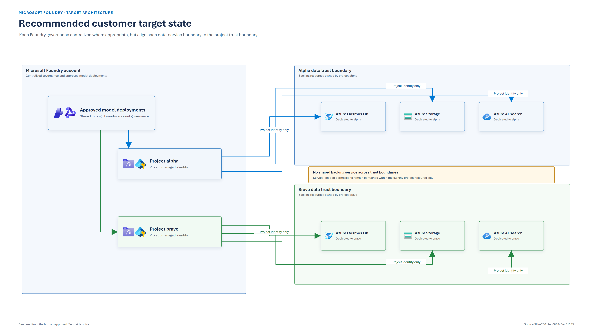
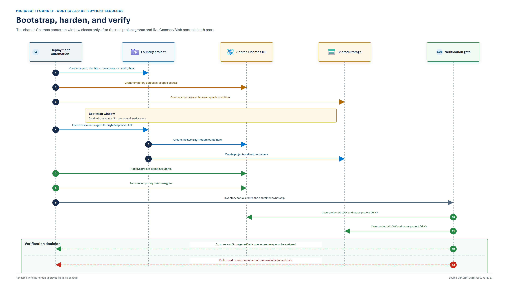

# Foundry project data-isolation hardening guide

Use this guide to decide, implement, and verify the backing-resource boundary for Microsoft Foundry
projects. Start with the audit. Do not begin by changing individual role assignments without first
deciding whether the projects belong in the same trust boundary.

## Target outcome

A completed design must satisfy all applicable statements:

- each project's data owner and sensitivity class are documented;
- separate trust boundaries use separate Cosmos DB, Storage, and AI Search resources;
- any shared Cosmos account has only project-container data grants after bootstrap;
- any shared Storage account uses tested project-prefix conditions and no unconditioned project data
  roles;
- vector data requiring project isolation uses one Search service per project;
- local/shared-key authorization is disabled;
- own-project access succeeds and cross-project access is denied by authorization, not merely by a
  network failure;
- the final configuration and test evidence are recorded together.

The [customer assessment](00-report.md) provides the evidence behind these requirements.

## 1. Audit the current environment

### 1.1 Classify the projects

For every project, record:

- customer or tenant represented;
- business and technical owner;
- data classification and residency requirement;
- retention and deletion requirement;
- incident-response and support ownership;
- use of vector stores, file search, uploaded files, or custom tools;
- connected Cosmos DB, Storage, and AI Search resource IDs.

If any of the first five items differ materially, treat the projects as separate trust boundaries.

### 1.2 Find broad Cosmos data grants

```powershell
$assignments = az cosmosdb sql role assignment list `
  --account-name <cosmos-account> `
  --resource-group <resource-group> -o json | ConvertFrom-Json

$assignments | Where-Object { $_.scope -notmatch '/colls/' } |
  Select-Object principalId, scope
```

For a shared account, any project identity returned by this query can reach beyond a single
container. Determine whether the scope is temporary bootstrap access or an unintended steady state.

### 1.3 Validate Blob assignments against actual containers

```powershell
$storageId = az storage account show `
  --name <storage-account> `
  --resource-group <resource-group> `
  --query id -o tsv

$actualContainers = @(
  az storage container list `
    --account-name <storage-account> `
    --auth-mode login -o json | ConvertFrom-Json |
  ForEach-Object { $_.name }
)

$blobAssignments = @(
  az role assignment list --scope $storageId --all -o json | ConvertFrom-Json |
  Where-Object { $_.roleDefinitionName -like 'Storage Blob Data *' }
)

$blobAssignments | Select-Object principalId, roleDefinitionName, scope, condition
```

Review for:

- project identities with an account-scoped data role and no condition;
- container-scoped assignments whose target name is not in `$actualContainers`;
- conditions that do not match the owning project's dashed GUID prefix;
- conditions that omit actions granted by the assigned role.

An assignment to an absent Blob container can be accepted by Azure and still provide no usable
access. Validate an own-project read; do not infer success from deployment status alone.

### 1.4 Map Search ownership

Create an explicit table of `project -> Search service resource ID`. If more than one project that
requires vector-data isolation points to the same Search service, the target architecture is not yet
met.

Single-index role assignments are supported by Azure AI Search. They are not a sufficient operating
model here unless your implementation has a durable, authoritative project-to-index mapping and
separates object-management permissions. The tested Foundry vector-store response did not expose
that mapping.

### 1.5 Check local authorization

```powershell
az cosmosdb show -n <cosmos-account> -g <resource-group> --query disableLocalAuth
az storage account show -n <storage-account> -g <resource-group> --query allowSharedKeyAccess
az search service show -n <search-service> -g <resource-group> --query authOptions
```

Expected posture:

- Cosmos `disableLocalAuth`: `true`;
- Storage `allowSharedKeyAccess`: `false`;
- Search configured for Azure RBAC without admin/query-key dependence.

Keys bypass the identity boundary assessed here.

## 2. Choose the target topology

| Condition | Cosmos DB | Storage | AI Search | Bootstrap window |
|---|---|---|---|---|
| Separate customer, tenant, ownership, sensitivity, residency, or incident boundary | Per project | Per project | Per project | None across projects |
| One trust boundary; vector stores or file search used | Shared with container grants | Shared with project-prefix ABAC | Per project | Bounded shared-Cosmos window |
| One trust boundary; no vector data requiring isolation | Shared with container grants | Shared with project-prefix ABAC | Shared only if accepted by design | Bounded shared-Cosmos window |



*Figure 1. Recommended target state. [Approved Mermaid contract](diagrams/recommended-customer-target-state.mmd).*

### Decision rule

Prefer a resource boundary over a complex permission boundary when the data or operating ownership
is different. Shared resources optimize cost and resource count; they also couple capacity,
configuration, incident response, and credential blast radius.

The shared option constrains direct data-plane requests; it is not a hostile-project boundary.
Capability-host provisioning leaves project identities with service-wide management roles on shared
Storage and Search. If compromise of one project identity must not affect another project, choose
separate backing resources.

This repository deploys the shared lab topology. It does **not** deploy one Search service per
project and must not be presented as the complete production target state.

## 3. Remediate each backing store

### 3.1 Cosmos DB

For a shared account, the steady-state project identity requires one assignment for each owned
container:

```text
/dbs/enterprise_memory/colls/<project-guid>-thread-message-store
/dbs/enterprise_memory/colls/<project-guid>-system-thread-message-store
/dbs/enterprise_memory/colls/<project-guid>-agent-entity-store
/dbs/enterprise_memory/colls/<project-guid>-agent-definitions-v1
/dbs/enterprise_memory/colls/<project-guid>-run-state-v1
```

Requirements:

1. Discover and verify all five containers before assigning roles.
2. Add all five container assignments.
3. Remove the project identity's database- or account-scoped data assignment.
4. Retain only the control-plane permissions required for service provisioning.
5. Verify the real identity configuration and live read behavior.

Inventory retained provisioning roles as an accepted residual risk. Do not claim container-scoped
Cosmos reads alone protect cross-project integrity or availability from an identity with broader
management permissions.

Cosmos rejects a role assignment for a container that does not exist. This is why shared Cosmos
requires the bootstrap sequence in section 4.

Cosmos and Storage assignment automation is in
[`terraform/rbac_isolation.tf`](../terraform/rbac_isolation.tf). The complete validation flow is in
[`scripts/deploy-and-harden.ps1`](../scripts/deploy-and-harden.ps1). Per-project Search isolation is
not deployed by this repository; see section 6.

### 3.2 Azure Storage

Use one account-scoped `Storage Blob Data Owner` assignment per project with an ABAC condition that
permits Blob data actions only when the container name starts with the project's dashed GUID.

Do not construct complete container names. The lab observed:

```text
<dashed-project-guid>-azureml-blobstore
<dashed-project-guid>-<service-assigned-segment>-azureml-agent
```

The service-assigned segment is not an infrastructure-as-code input. A prefix condition covers both
containers without assuming the remainder of the name.

A condition must account only for actions present in its role. Reusing an owner-role condition on a
reader role can fail validation because the reader does not grant write/delete actions. Keep role-
specific conditions and test both own-project and cross-project reads.

### 3.3 Azure AI Search

For strict vector-data separation:

1. allocate one Search service per project;
2. point each Foundry project connection to only its service;
3. scope Search data and object-management roles to that service;
4. verify that each project identity has no assignment on another project's service;
5. test an authorized query on the owning service;
6. record the connection and role inventory as completion evidence.

Do not use this repository's Search probe to certify that target state. The probe deliberately uses
one shared service and expects service-scoped access to span both tested indexes so it can reproduce
the finding.

## 4. Bootstrap and harden shared Cosmos



*Figure 2. Bootstrap, harden, and verify. [Approved Mermaid contract](diagrams/bootstrap-harden-verify-sequence.mmd).*

Two modern containers appear only after a project's first Responses API invocation. The initial
agent call therefore needs access before all container scopes exist.

### Mandatory sequence

| Step | Action | Gate |
|---|---|---|
| 1 | Create projects and connections without assigning users or applications | No real workload can reach the projects |
| 2 | Apply temporary database-scoped Cosmos access | Only synthetic data is permitted |
| 3 | Apply the project-prefix Storage condition | Own project prefix only |
| 4 | Invoke one canary agent per project through Responses API `v1` | Distinct canary response captured |
| 5 | Discover five Cosmos and two Blob containers per project | Every resource attributable |
| 6 | Add five Cosmos container grants per project | All owned containers covered |
| 7 | Remove temporary broad Cosmos grants | No project grant above container scope |
| 8 | Run configuration and behavior verification | Fail closed on any mismatch |
| 9 | Remove canary data | Clean handover state |
| 10 | Assign users and applications | Only after evidence is accepted |

For this validation lab:

```powershell
.\scripts\deploy-and-harden.ps1
```

The bootstrap window is acceptable only because it is bounded, contains synthetic data, has no user
access, and ends in a fail-closed gate. If that operating guarantee cannot be made, use a Cosmos DB
account per project.

Precreating the service-owned containers is not recommended. Their indexing policy is controlled by
the service and may evolve; reproducing it transfers an unsupported schema dependency into customer
infrastructure code.

## 5. Verify Cosmos and Storage

```powershell
.\scripts\deploy-and-harden.ps1 -VerifyOnly
```

The verifier requires both:

### Configuration

- exactly five container-scoped Cosmos data grants per project identity;
- no broader project Cosmos data grant;
- exactly one account-scoped, conditioned Storage Blob Data Owner grant per project;
- no unconditioned account-scoped Blob data grant on a project identity;
- all expected containers attributable to a project.

### Behavior

- broad controls can reach both projects, proving the path is live;
- each scoped probe can read its own project's Cosmos and Blob resources;
- each scoped probe is denied against the other project for both stores;
- network refusals and unexpected errors invalidate the result.

Then produce a manifest-bound record:

```powershell
.\scripts\12-collect-evidence.ps1 -SkipAgents
```

See the [validation runbook](03-validation-runbook.md) for artifact and publication requirements.

## 6. Validate the Search decision

### Shared-service lab decision

Run the full collector. Expected results are single-index enforcement, service-wide reach, and opaque
project attribution. This confirms the reason for the recommendation; it does not harden Search.

### Per-project target-state decision

Record and review:

- one unique Search service resource ID per project;
- project connection target;
- project identity role assignments on the owning service;
- absence of roles on other project services;
- local key disablement;
- private endpoint and DNS path where required;
- an authorized own-service query.

A network refusal to the other service is useful defense in depth but is not a substitute for
confirming that no cross-project authorization grant exists.

For mutually untrusted projects, validation must also show that no project identity holds management
permissions on another project's backing resource. The simplest enforceable design is one backing
resource set per project.

## 7. Recover from failed verification

If any gate fails:

1. do not assign users, applications, or real data;
2. preserve the phase logs and partial evidence for diagnosis, but do not label them assurance;
3. identify whether the failure is configuration, authorization, network, propagation, or probe
   behavior;
4. correct the smallest failing layer;
5. rerun `deploy-and-harden.ps1 -VerifyOnly`;
6. generate a new evidence run rather than editing a failed artifact;
7. if the bootstrap window cannot be closed predictably, redeploy with separate Cosmos accounts.

Common responses:

| Failure | Response |
|---|---|
| Modern containers absent | Reinvoke the canary agent, wait for discovery, and do not attempt absent-container Cosmos roles |
| Own-project Blob denial | Inspect the role-specific condition, actual dashed prefix, principal ID, and propagation |
| Cross-project allow | Remove the broad project grant, re-inventory, then rerun both positive and negative controls |
| `BLOCKED` | Restore the intended test path or move probes inside the approved network; never count it as `DENY` |
| Search ownership ambiguous | Stop concurrent index creation and rerun serially; never select an arbitrary index |
| Capability host conflict | Inspect capacity, increase configured staggering when contention is confirmed, destroy the partial host, and redeploy |

## 8. Record completion

The change record should contain:

- approved trust-boundary decision;
- project-to-backing-resource inventory;
- final Cosmos and Storage assignment inventory;
- Search separation decision and connection inventory;
- local-auth and network configuration evidence;
- manifest-valid probe run ID and hashes;
- canary cleanup confirmation;
- named service owner and access-review cadence;
- accepted limitations or residual risks.

### Completion checklist

**Architecture**

- [ ] Project trust boundaries are approved by security and data owners.
- [ ] Separate backing resources are used where ownership or sensitivity differs.
- [ ] Search is separate wherever vector data requires a hard project boundary.

**Authorization**

- [ ] No shared-account project identity has a Cosmos grant broader than its containers.
- [ ] Every shared-Storage project role has the approved project-prefix condition.
- [ ] No dead container assignment or unconditioned project data role remains.
- [ ] Local/shared-key authorization is disabled.

**Verification**

- [ ] Own-project controls succeed for Cosmos and Blob.
- [ ] Cross-project controls are denied by authorization for both stores.
- [ ] Search decision is validated by the appropriate shared-lab or per-project procedure.
- [ ] Evidence passes the offline contract validator.
- [ ] Synthetic data is removed before handover.

**Operations**

- [ ] Data-plane diagnostics and retention are configured.
- [ ] Access recertification and incident ownership are assigned.
- [ ] Teardown, purge, and recovery procedures are tested for the environment.
